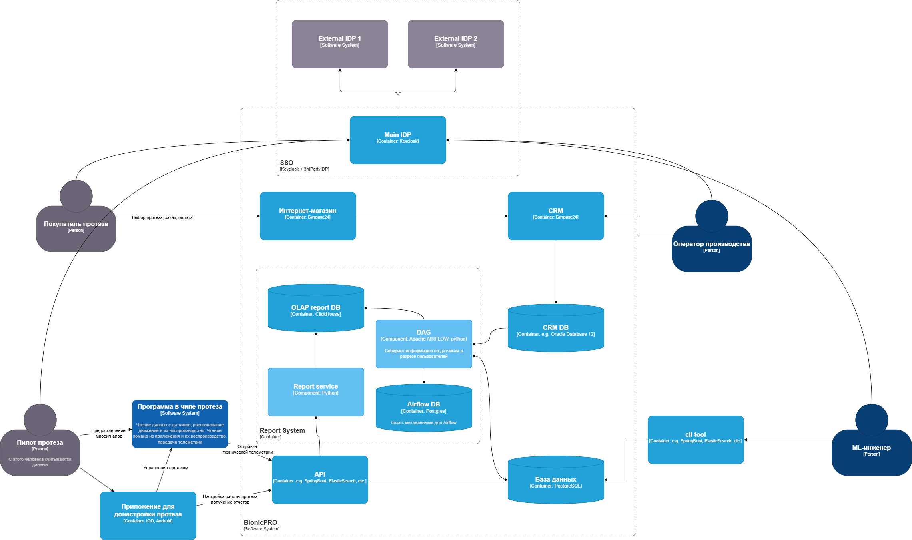

# Задание 1

## Задача 1. Предложить архитектурное решение и доработайть диаграмму C4 для управления учётными данными пользователя. 

**Предпосылки**: 

- Ранее был реализован SSO через Oauth2.0 Code Grant в Keycloak. С тех пор компанию успели взломать. И это даже несмотря на то, что мы использовали Code Grant.
Хакеры воспользовались уязвимостью и скачали персональные данные пользователей по всем протезам. 

- Компания ожидает выход на новые рынки и соблюдение требований законодательства. Компания сейчас работает только в России, но планирует осваивать новые рынки и развивать свои продукты в других странах. BionicPRO работает с медицинскими данными, и во многих странах есть требования к хранению такой информации. Нужно учитывать, что правовое регулирование в разных странах может отличаться. Важно продумать, как будут храниться данные о пациентах, в том числе — авторизационные.

**Требования**:

   -  Произвести унификацию доступа в системе BionicPRO. Это будет осуществляться через запрос данных учётных записей из внешнего источника, который расположен в стране представительства компании. Принципы локального хранения персональной и медицинской информации не должны быть нарушены.
   -  Безопасную схему работы с access- и refresh-токенами, которая исключает передачу фронтенду токенов, которые были получены от IdP.
   -  Возможность поддержки аутентификации пользователей через различные внешние удостоверяющие службы, действующие в разных странах.
  

#### Предлагаемое решение: 

В нашей системе уже развернут SSO c использованием Keycloak.
Будем использовать предоставляемые им возможности

**Реализация "аутентификации пользователей через различные внешние удостоверяющие службы":**

Необходимо в keycloak настроить использование Federated Identity

- В зависимости от страны использования клиента будет редиректить на соответсвующий ей Identity Provider (обозначим *3rdPartyIDP*)
- Пользователь будет авторизоваться и аутентифицироваться в этом 3rdPartyIDP
- 3rdPartyIDP выдает assertion, который распознается и парсится основным IDP
- основной IDP выдает токен для работы с бэком приложения  


Предлагаемая схема
[Диаграмма с SSO](diagrams/BionicPRO_C4_with_FI_keycloak.drawio)

Комментарии:
- Необходимо произвести корректное разделение пользователей системы BionicPRO
  - При текущей архитектуре есть как клиенты-пользователи (конкретные люди), так и клиенты-приложения
  - В частности обращаю внимание на приложение *cli tool* для аналитики данных
  - Данное приложение напрямую обращается к БД где хранятся пользовательские данные
  - Необходимо разобраться ходит ли оно в базу "под своим" пользователем, либо под пользователями конкретных ML инженеров 


## Задача 2. Улучшите безопасность существующего приложения, заменив Code Grant на PKCE

- во фронте приложения при инициализации Keycloak добавлено `pkceMethod: "S256"` 
  -  фронт приложения генерирует code_challenge и code_verifier при обращении к keycloak
     ```js
        import Keycloak, { KeycloakConfig, KeycloakInitOptions } from 'keycloak-js';

        ...

        const initOptions: KeycloakInitOptions = {
            pkceMethod: "S256"
        }

        const keycloak = new Keycloak(keycloakConfig);

        ...
        <ReactKeycloakProvider authClient={keycloak} initOptions={initOptions}>
        ...
   ```  
-  Конфигурацию самого Keycloak для работы с PKCE можно изменить через GUI админку на вкладке Clients>client-frontend>Advanced
   - затем сделав на этой вкладке Export конфига, понял, как добавить этот параметр в `realm-export.json`:
   ```json
    {
        "clientId": "reports-frontend",
        "enabled": true,
        "publicClient": true,
        "redirectUris": ["http://localhost:3000/*"],
        "webOrigins": ["http://localhost:3000"],
        "directAccessGrantsEnabled": true,
        "attributes": {
          "pkce.code.challenge.method": "S256"
        }
    },
   ```                  

# Задание 2. Разработка сервиса отчётов

## Задача 1. Создать архитектуру решения для подготовки и получения отчётов.

**Предпосылки**: 

- Огромный объём данных. Изначально у компании была только одна база данных — PostgreSQL. Очень быстро она начала ухудшать показатели работы системы. Команда попробовала использовать индексы, но и это не помогло: слишком большое количество данных начало влиять на остальные таблицы базы. 


**Требования**:

-  Решение должно включать в себя ETL-процесс, который объединяет данные с датчиков и данные из CRM, используя Apache Airflow, и формирует готовую витрину отчётности в OLAP БД. Итоговый отчёт по пользователю должен быть доступен через бэкенд-сервис API, который обозначен на исходной архитектуре. 

#### Предлагаемое решение: 

- Предлагается использовать в качестве OLAP базы колоночную ClickHouse
- сервис отчетов на Python
- Apache AirFlow с DAG

Предлагаемая схема
[Диаграмма с SSO](diagrams/BionicPRO_C4_reports.drawio)

Комментарии:



## Задача 2. Разработать Airflow DAG и настроить его на запуск по расписанию

**Реализация**:

1. Для моделирования источников подняты две Postgres базы:
- **main-db** c таблицей `telemetry` 
- **crm-db** c таблицей `users`

Данные в них загружаются скриптами при инициализации

2. Также поднят экземпляр **clickhouse**

В ней также при инициализации создаются база `report` и соответсвующие таблицы `users` и `telemetry`  

3. подянты компоненты airflow
   - postgres **airflow-db** для метаданных aitflow
   - **airflow-init** - блок инициализации
   - **airflow-webserver** - веб сервер
   - **airflow-scheduler** - планировщик

Отличия от реализации из практики урока: 
я стал использовать более новый aiflow 3.1
в нем **airflow-webserver** запускается в `command: standalone` режиме, сам создает админ пользователя со сложносгенерированным паролем
чтобы его узнать необходимо найти его в логах запуска сервиса. Иначе никак (sic!)
```bash
$ docker-compose logs airflow-webserver | grep "Simple auth"
```
**airflow-init** скрипт инициализации содержит только миграцию бд

4. Реализован airflow DAG `postgres_to_clickhouse_ETL`

```python
   with DAG(
      'postgres_to_clickhouse_ETL',
      description='Загрузка данных из main-db таблица telemetry и crm-db таблица users и последующая загрузка данных в clickhouse ',
      start_date=datetime(2025, 9, 28),
      schedule=timedelta(minutes=3),
      catchup=False,
      default_args={
         'retries': 5,
         'retry_delay': timedelta(seconds=10),
      },
      tags=['postgres', 'crm-db', 'main-db']
   ) as dag:

      check_connection_task_main = PythonOperator(
         task_id='check_connection_main',
         python_callable=check_main_connection,
      )

      check_connection_task_crm = PythonOperator(
         task_id='check_connection_crm',
         python_callable=check_crm_connection,
      )

      check_connection_task_clickhouse = PythonOperator(
         task_id ='test_clickhouse',
         python_callable = test_clickhouse_connection,
      )

      load_data_task = PythonOperator(
         task_id='load_data_to_clickhouse',
         python_callable=query_and_load_to_clickhouse,
      )

      check_connection_task_crm >> check_connection_task_main >> check_connection_task_clickhouse >> load_data_task
```

- он выполняет последовательную проверку доступности баз
- после чего производит перегрузку данных пришедших со времени последней запаси в соответсвующие clikhouse таблицы
- запускается с указанной даты каждые три минуты


подробности реализации:
[Реализация ETL DAG](reportSystem\airflow\dags\src\postgres_to_clickhouse.py)


## Задача 3. Создайте бэкенд-часть приложения для API

**Решение**:

- Реализован REST API на Python Flask
- сервис подключается к нашей **clickhouse** базе 
- у апи реализовано два эндпоинта health и api/reports
- api/reports:
  - доступен на `http://localhost:5000/api/reports`
  - выгружает таблицу с телеметрией по всем пользователям


##  Задача 4. Реализуйте ограничение доступа к эндпоинту отчётности.

**Решение**:
- Доработана конфигурация загрузки Keycloak с добавлением туда на наших тестовых пользователей из **crm-db**

   *Вообще предполагаю что при корректной логике реализации системы система **CRM** должна добавлять новых пользователей в Keycloak при их регистрации в системе*

- Доработан REST API из прошлой задачи, доработан эндпоинт api/reports с использованием декоратора проверяющего токен
  - декоратор проверяет наличие и валидирует токен
  - публичный ключ для валидации получаем с эндпоинта кейклока (как я понял, это стандартная практика)
  - сам метод проверяет доступ пользователя к отчетам проверяя его роль на соответсвие `"prothetic_user"`
  - также использует `"username"` пользователя как идетификатор для фильтрации данных
  - общие параметры пользователя для отчета также парсятся из токена   

подробности реализации:
[Реализация reportService](reportSystem\reportService\app.py)

## Задача 5. Добавьте в UI кнопку получения отчёта и вызова эндпоинта его генерации.

**Решение**:

- доработан **reportService** для работы с CORS (стоит по умолчанию wildcard)
- переработан frontend:
  - отображение вошедшего пользователя
  - отображение персональных данных и отчета по нажатию на кнопку   

доступен на `http://localhost:3000/`
